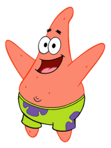

  
# Example of two subfig figures

{#fig:spongebob width=48%} \hfill
{#fig:patrick width=48%}

Two magnificent creatures of the sea.

Best buddies in [@fig:sbsp]. The protagonist in [@fig:spongebob] and his trusty sidekick in [@fig:patrick].

---

# Example of three subfig figures

{#fig:rainbow-dash width=30%} \hfill
{#fig:twilight-sparkle width=30%} \hfill
{#fig:pinkie-pie width=30%}

Look at my pretty horses!

We can refer to these fine stallions in several ways:

* **Refer to subfig labels:** Notice the awesome stripes of [@fig:twilight-sparkle], and the bushy tail of [@fig:pinkie-pie] and finally the colorful tail of [@fig:rainbow-dash].
* **Refer to range of labels:** Look at all the pretty horses in subfigures [@fig:twilight-sparkle;@fig:pinkie-pie;@fig:rainbow-dash].
* **Refer to overall figure:** Or simply behold the sight of @fig:horses.